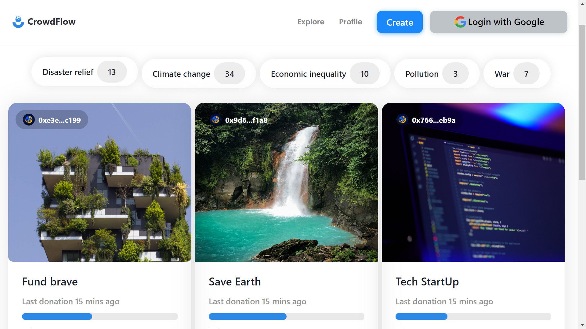

# CrowdFlow

## Project Overview

CrowdFlow is a decentralized application (dApp) designed to streamline fundraising and liquidity management using blockchain technology. This platform leverages smart contracts to enable transparent, secure, and automated donation processes. By integrating with decentralized exchanges (DEXs), CrowdFlow ensures efficient liquidity provision, enhancing the overall utility and value of raised funds.

CrowdFlow launches a dedicated token for each fundraising campaign immediately upon its creation. This token is used to incentivize donations and provide liquidity. For every donation, portions of the fundraiser token are minted: half is given to the donor, and the other half is added to a liquidity pool for trading.

## Key Features

### Decentralized Fundraising:

- **Secure Donations:** Users can donate securely using blockchain technology, ensuring transparency and immutability.
  
- **Automated Token Minting:** Upon donation, fundraiser tokens are automatically minted and distributed to donors as proof of contribution.
Fund Receipts: Donors receive digital receipts for their contributions, maintaining a verifiable record of transactions.

### Liquidity Pool Integration:

- **Automated Liquidity Provision:** A portion of each donation is automatically added to a liquidity pool on a DEX, enhancing the liquidity of the fundraiser's token.

- **Liquidity Pool Creation:** If no existing liquidity pool is found, a new one is created, ensuring continuous liquidity provision.
Efficient Fund Management:

- **Token Treasury:** Each fundraising campaign has a token treasury, ensuring a dedicated supply of fundraiser tokens.
  
- **Transparency and Accountability:** The use of blockchain ensures that all transactions are transparent and traceable, promoting accountability.

## Benefits

- **Enhanced Liquidity:** Automatic liquidity provision ensures that fundraiser tokens have sufficient liquidity on the DEX, making them more attractive to potential donors and investors.
    
- **Transparency:** Blockchain-based transactions ensure full transparency, increasing trust among donors.
    
- **Automation:** Smart contracts automate critical processes, reducing administrative overhead and ensuring timely execution of tasks.

## Use Cases

- **Charity Fundraising:** Non-profits can leverage CrowdFlow for transparent and efficient fundraising, ensuring that donations are used effectively.

- **Project Funding:** Startups and projects can raise funds while providing immediate liquidity for their tokens, enhancing their market presence.

- **Community Initiatives:** Community-driven projects can benefit from automated and transparent fundraising mechanisms.





# 🛠 Technology Stack & Tools

- MOVE (Writing Smart Contract)
- ZKlogin (Authentication)
- Javascript (NextJs & Unit Testing)
- Mysten/SUI JS (Blockchain Interaction)
- SUI MOVE (Smart Contract Development Framework)
- IPFS (File Storage)
- Supra Oracle (Oracle)
- Pyth (Price feed)

# ⚙ Requirements For Initial Setup
- Install NodeJS, should work with any node version below 16.5.0
- Install RUSTC and SUI in your terminal. You can check to see if you have truffle by running sui --version.

# 🚀 Quick Start

📄 Clone or fork CrowdFlow:

```
https://github.com/paschal533/CrowdFlow.git
```
💿 Install all dependencies:
 
```
$ cd CrowdFlow
$ cd frontend
$ npm install 
```

# 🎗 Add enviroment varibles

Rename the file `env.local.example` to `env.local`

Add all the required enviroment varibles in the file

```
NEXT_PUBLIC_INFURA_IPFS_PROJECT_ID =  
NEXT_PUBLIC_INFURA_IPFS_PROJECT_SECRET = 
NEXT_PUBLIC_INFURA_ProjectAPIKey =  
NEXT_PUBLIC_CLIENT_ID = 
NEXT_PUBLIC_CLIENT_SECRET = 
NEXT_PUBLIC_PROVER_URL = https://prover-dev.mystenlabs.com/v1

NEXT_PUBLIC_REDIRECT_URL = http://localhost:3000/callback

NEXT_PUBLIC_OPENID_PROVIDER_URL = https://accounts.google.com/.well-known/openid-configuration

NEXT_PUBLIC_FULLNODE_URL = https://fullnode.testnet.sui.io:443

NEXT_PUBLIC_PACKAGE_ID = 0xe3e4ef7008b9ebd94626389c287e2da6441fea405471eb268d41cb51b1efc199

```

# 🚴‍♂️ Run your App:

```
npm run dev
```

- Note :- This Dapp's smart contract was deploy on SUI testnet.

# 📄 interacting with the Smart-contract

```
$ cd CrowdFlow
$ cd crowdflow-contract
```

# 🛠 Test the Smart-contract:

```
sui move test
```

# 🎗 Compile the Smart-contract:

```
sui move build
```

# 🔗 Deploy the Smart-contract:


```
sui client publish --gas-budget 1000000000
```

# 📄 PACKAGE ID

```
0xe3e4ef7008b9ebd94626389c287e2da6441fea405471eb268d41cb51b1efc199
```

# 📜 SUI Testnet Explorer

```
https://suiscan.xyz/testnet/object/0xe3e4ef7008b9ebd94626389c287e2da6441fea405471eb268d41cb51b1efc199/contracts
```
